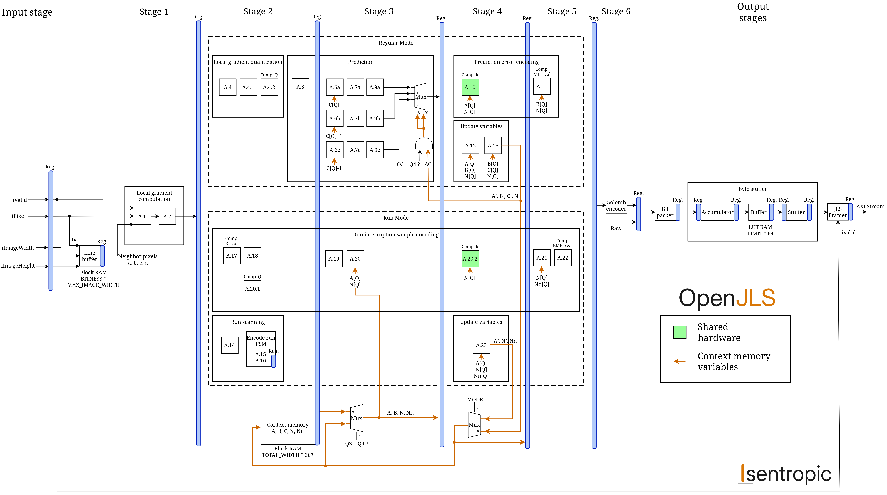
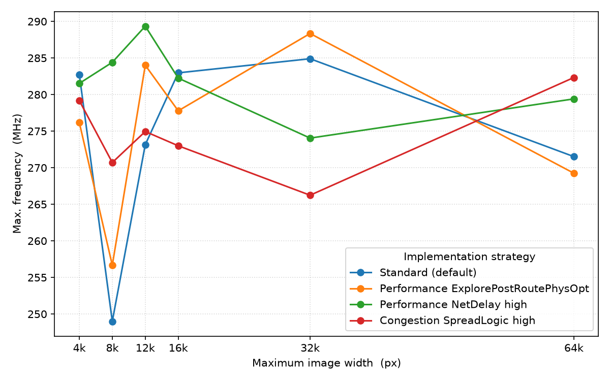
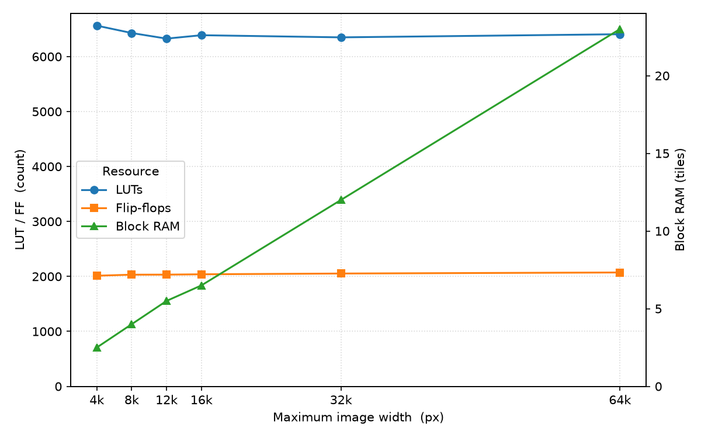

<picture>
  <source media="(prefers-color-scheme: dark)" srcset="Docs/Images/openjls-wordmark-dark.svg">
  
</picture>

OpenJLS is an open, verification-signed JPEG-LS encoder IP core for FPGAs - the open alternative to closed, commercial JPEG-LS cores, for teams who want to audit the RTL and evaluate before they buy.

It implements the JPEG-LS standard (ISO/IEC 14495-1 / ITU-T T.87), a low-complexity lossless image codec with compression ratios comparable to JPEG 2000 lossless at a fraction of the computational cost. Every release is checked byte-exact against an independent reference encoder across 287 images, including post-synthesis (see [Verification report](https://isentropic-fpga.github.io/OpenJLS/)).

OpenJLS reaches ~280 MHz on a Xilinx UltraScale+ ZU7EG (the MPSoC family used in onboard processors such as the Xiphos Q8), processing one pixel per clock (~280 Mpixel/s) for ~6.4k LUTs and no external memory. It handles single-component (grayscale) data, so a multi-band sensor instantiates one compressor per band - resource usage is low enough that all bands run in parallel cheaply.

The RTL is vendor-neutral by construction (plain VHDL-1993 on open-logic memory primitives, which are VHDL-2008) and builds in any synthesis tool; the figures above were characterized on Xilinx.

---

## Resources

- **[Product page](https://isentropic.com.br/openjls)**
- **[Datasheet (PDF)](Docs/datasheet/openjls_datasheet.pdf)**
- **[Verification report](https://isentropic-fpga.github.io/OpenJLS/)**
- **[Interface & integration](#interface)**
- **[Licensing](#licensing)**
- **[Demos](https://github.com/isentropic-fpga/OpenJLS-Demos)**

---

## Features

Specifications

- **Compression** — Lossless JPEG-LS
- **Pixel Bit depth** — 8 to 16 bits
- **Components** — Single-component (grayscale)
- **Image size** — Configurable up to 64k × 64k px (minimum 4 × 1)
- **Memory** — Line buffer, as big as image width, on-chip
- **Throughput** — One pixel per clock cycle
- **Interface** — Ready/valid streaming handshake (AXI4-Stream / Avalon-ST compatible)
- **Conformance** — Bit-exact against the ISO/IEC 14495-1 reference and golden-model [CharLS](https://github.com/team-charls/charls)
- **Portability** — Vendor-agnostic VHDL, due to memory-agnostic IPs from [open-logic](https://github.com/open-logic/open-logic)

---

## Verification

OpenJLS is verified by simulation with [NVC](https://www.nickg.me.uk/nvc/) using a layered suite that combines constrained-random self-checking tests, functional coverage, and byte-exact comparison against an independent reference encoder — run at both the RTL and post-synthesis (gate-level) stages:

> **Browse the latest [verification report](https://isentropic-fpga.github.io/OpenJLS/)** — a published snapshot aggregating the OSVVM and NVC HTML reports and the post-synthesis verification logs. It is updated when the reports are regenerated and committed, not on every push.

| Suite | Status | Test/Cov | Summary |
|---|---|---|---|
| NVC code coverage | info | 99.8% | Per-DUT-file statement breakdown |
| OSVVM suite | PASS | 100% | 60 tests, 2,877,433 affirmations (module + top + AXI wrappers) |
| Golden model | PASS | 100% | 287/287 images byte-exact vs CharLS |
| Post-synth OSVVM | PASS | 100% | Control-plane stress on the gate-level netlist |
| Post-synth golden model | PASS | 100% | 156/156 images byte-exact vs CharLS |
| Hardware-in-the-loop | PASS | 100% | 287/287 images byte-exact vs CharLS on PYNQ-Z2 silicon |

- **OSVVM** — 29 module testbenches check each module against an independent behavioral reference derived from ITU-T T.87; a top-level testbench stresses the control plane (reset injection, backpressure, back-to-back images, dimension fallback); AXI wrapper testbenches drive the AXI4-Stream and AXI4-Lite wrappers with OSVVM verification components (byte-exact pass-through at 8- and 12-bit, register map, live reconfiguration, mid-image abort) — all with requirements tracking.
- **Coverage** — OSVVM functional coverage plus NVC structural code coverage (99%+ statements).
- **Golden model** — Output bitstream compared byte-exact against [CharLS](https://github.com/team-charls/charls), an independent C++ reference encoder, plus the official ISO/IEC 14495-1 reference vectors.
- **Design contracts** — Embedded PSL assertions (ready/valid and internal handshakes) checked every run.
- **Post-synthesis** — The top-level stress test and a golden-model subset re-run on the synthesized gate-level netlist, confirming synthesis preserved behavior.
- **Hardware-in-the-loop** — The full 287-image corpus streamed to a PYNQ-Z2, encoded end-to-end in the FPGA across depths 8–16 (one bitstream per depth), and byte-compared against CharLS on real silicon — zero mismatches. Reproducible from a clean clone via the [EncodeOverEthernet demo](https://github.com/isentropic-fpga/OpenJLS-Demos).

**Golden-model dataset.** The corpus is **287 images** pulled from public datasets and exercised across the full datapath:

| Source | Set | Images |
|---|---|--:|
| [USC-SIPI](https://sipi.usc.edu/database/) | Aerials, textures, miscellaneous, sequences | 210 |
| [imagecompression.info](http://imagecompression.info/test_images/) | 8-bit and 16-bit natural photographs | 30 |
| Generated stress probes | Boundary, predictor-adversarial, high-entropy and fuzz patterns | 47 |

The real datasets give natural image statistics from 256×256 up to **39 megapixels** (7216×5412); the generated probes target what real images never reach. [`gen_stress.py`](Verification/Golden%20model/imageprep/gen_stress.py) emits them deterministically (seeded, byte-reproducible), covering:

- **Intermediate bit depths (9–15)** — the only coverage of this range; no natural dataset exists here.
- **Boundary geometries** — smallest legal image (4×1), tall single-column images, and single rows up to 65535×1.
- **Predictor-adversarial content** — checkerboard, stripes, and sparse spikes that defeat the MED predictor every pixel, plus incompressible noise.
- **Tiny-image fuzz batch** — many small randomized images stressing start/end-of-image edges more densely than full-size images can.

---

## Demos

End-to-end example projects live in a companion repository,
[**OpenJLS-Demos**](https://github.com/isentropic-fpga/OpenJLS-Demos), each pinning
the core as a submodule at its verified commit.

- **[EncodeOverEthernet](https://github.com/isentropic-fpga/OpenJLS-Demos/tree/main/EncodeOverEthernet)** — streams raw images to a PYNQ-Z2 over Ethernet, encodes them 100% in the FPGA, and streams the `.jls` files back. Its hardware-in-the-loop sweep is what produces the [HIL verification result](#verification) above.

More demos (additional boards and integrations) are planned.

---

## Architecture

OpenJLS follows the JPEG-LS encoding pipeline:

1. **Gradient computation** — local gradients from causal pixel neighbors (a, b, c, d)
2. **Context modeling** — gradient quantization into 365 contexts with adaptive bias correction
3. **Prediction** — MED (Median Edge Detector) with context-based bias cancellation
4. **Encoding** — adaptive Golomb-Rice coding for regular mode, run-length encoding for uniform regions
5. **Bitstream packing** — ISO/IEC 14495-1 compliant JPEG-LS output stream

The hardware architecture is based on the optimizations in Mert's [*Key Architectural Optimizations for Hardware Efficient JPEG-LS Encoder*](https://www.researchgate.net/publication/331795298_Key_Architectural_Optimizations_for_Hardware_Efficient_JPEG-LS_Encoder), reworked into a vendor-agnostic, fully pipelined VHDL core.

[`Docs/Requirements.md`](Docs/Requirements.md) is the **source of truth** for the RTL. Every source file under [`Sources/`](Sources/) implements exactly one topic from it — a code segment or written requirement — and is named after that topic. Each and every one of those topics was taken **verbatim from ISO/IEC 14495-1 (ITU-T T.87)**.

---

## Interface

The core is a single entity, `openjls_top`, configured by generics and driven through a pixel-in / bitstream-out streaming interface.

### Generics

| Generic | Range | Description |
|---|:--:|---|
| `BITNESS` | 8–16 | Pixel bit depth. |
| `MAX_IMAGE_WIDTH` | 4–65535 | Largest image width supported; sets the on-chip line-buffer depth. |
| `MAX_IMAGE_HEIGHT` | 1–65535 | Largest image height supported. |
| `OUT_WIDTH` | 48–1024 | Output data-bus width in bits (multiple of 8). |

> `MAX_IMAGE_WIDTH` and `MAX_IMAGE_HEIGHT` set the **compile-time** maximum image size — they size the on-chip line buffer and the dimension counters, so a larger maximum costs more BRAM. They don't pick the size of any given image: the dimensions of each encoded image are selected at **run time** through the `iImageWidth`/`iImageHeight` ports (see [Ports](#ports)), which accept any value from the minimum up to the configured maximum.

### Ports

The streaming ports use a plain **ready/valid handshake**; the *AXIS* column gives the 1:1 AXI4-Stream signal mapping for that ecosystem (Avalon-ST maps the same way at `readyLatency = 0`).

| Port | Dir | Width | AXIS | Role |
|---|:--:|---|:--:|---|
| `iClk` | in | 1 | — | Clock; whole core is synchronous to its rising edge. |
| `iRst` | in | 1 | — | Synchronous reset, active high. Also latches the image dimensions (see below). |
| `iImageWidth` | in | 16 | — | Image width in pixels (configuration). |
| `iImageHeight` | in | 16 | — | Image height in pixels (configuration). |
| `iValid` | in | 1 | `TVALID` | Input pixel valid. |
| `iPixel` | in | `BITNESS` | `TDATA` | Input pixel. |
| `oReady` | out | 1 | `TREADY` | Input ready. |
| `oData` | out | `OUT_WIDTH` | `TDATA` | Output bitstream beat. |
| `oValid` | out | 1 | `TVALID` | Output valid. |
| `oKeep` | out | `OUT_WIDTH/8` | `TKEEP` | Valid-byte mask on the final beat. |
| `oLast` | out | 1 | `TLAST` | End of image. |
| `iReady` | in | 1 | `TREADY` | Output ready / downstream backpressure. |

### Integration notes

- **Pixel stream.** Feed pixels in **scan order** — the first row left to right, then the second row, and so on — one per accepted handshake (`iValid and oReady`), each an unsigned value on `iPixel`. The encoder sustains one pixel per clock and deasserts `oReady` *only* under downstream backpressure (`iReady` low). The output bitstream is byte-serial, MSB-first.
- **Image dimensions are configuration, sampled while `iRst` is high** — hold them stable and pulse reset before a new resolution. They latch only during reset, so reset before the first image and whenever the size changes; **no reset is needed between same-size images** — they encode back-to-back. Unwired inputs (`0`) select the `MAX_IMAGE_*` maxima; an out-of-range value falls back to the maximum with a simulation warning. Both ports are a fixed 16 bits regardless of the `MAX_IMAGE_*` generics, so any out-of-range value is caught. Minimum image is **4 × 1**.
- **No input end-of-frame.** End-of-image is derived internally from the dimensions, so the input has no `TLAST` (optional in AXI4-Stream). The *output* stream is self-delimiting: `oLast` marks the last beat and `oKeep` flags its valid bytes.
- **Naming.** Port names follow the project's house style; the signals map 1:1 onto AXI4-Stream (see the *AXIS* column), so a conventional-naming `s_axis`/`m_axis` wrapper can be layered on top without touching the core.
- **Block-diagram drop-in.** Being a single entity with standard ready/valid ports, `openjls_top` can be dropped onto a block diagram and wired there instead of instantiated in HDL. The dimension ports are fixed at 16 bits (rather than sized from the generics) because Vivado's block-design port-width evaluator only handles literal arithmetic.

> Full signal timing, the reset/configuration sequence, latency figures, and a worked instantiation example live in the **datasheet** (`Docs/datasheet/`).

### Xilinx IP cores

For the Vivado flow the core ships the following pre-packaged IPs:

| IP Catalog name | Interfaces |
|---|---|
| OpenJLS Encoder (Native) | Plain Ready/Valid |
| OpenJLS Encoder (AXI4-Stream) | AXI-Stream for the data, native pins for control |
| OpenJLS Encoder (AXI4-Stream + AXI4-Lite) | AXI-Stream for the data, AXI-Lite for control |

To use, simply add [`Sources/Xilinx/ip_repo/`](Sources/Xilinx/ip_repo/) to the project's IP repositories and the three cores appear in the IP Catalog, ready to drop onto a block design.

#### AXI4-Lite register map

The AXI4-Lite variant replaces the native control pins with a register bank (32-bit registers, word-aligned offsets):

| Offset | Name | Access | Contents |
|---|---|---|---|
| `0x00` | ID | RO | ASCII `"OJLS"` (`0x4F4A4C53`) |
| `0x04` | VERSION | RO | `0x00MMmmpp` (major/minor/patch) |
| `0x08` | CAPS | RO | `[7:0]` `BITNESS`, `[15:8]` output bytes per beat (`OUT_WIDTH`/8) |
| `0x0C` | MAXDIM | RO | `[15:0]` `MAX_IMAGE_WIDTH`, `[31:16]` `MAX_IMAGE_HEIGHT` |
| `0x10` | WIDTH | RW | `[15:0]` image width (clamped on write) |
| `0x14` | HEIGHT | RW | `[15:0]` image height (clamped on write) |
| `0x18` | CTRL | WO | `[0]` APPLY — self-clearing, pulses the core reset |
| `0x1C` | STATUS | RO | `[0]` BUSY (reset pulse active), `[1]` pixel-stream `TREADY` mirror |

The core samples the dimensions only while its reset is high, so reconfiguration is: write WIDTH/HEIGHT, set CTRL.APPLY. APPLY pulses the core reset for one clock; while it is active STATUS.BUSY reads 1 and the pixel stream's `TREADY` is held low, so a stream started too early stalls instead of losing pixels — WIDTH/HEIGHT/CTRL writes while BUSY are dropped. Back-to-back images of unchanged dimensions need no APPLY.

WIDTH/HEIGHT writes are merged per `WSTRB` and clamped to the core's rule (out-of-range values become the MAX generic), so a readback always returns the value the core will actually use. Writes to RO or unmapped offsets are acknowledged (OKAY) and dropped; unmapped reads return zero.

For driver code the map ships as a copy/paste C header — [`Sources/Xilinx/ojls_regs.h`](Sources/Xilinx/ojls_regs.h) — including the CAPS/MAXDIM field-extraction macros and the core minima (`OJLS_MIN_WIDTH`/`OJLS_MIN_HEIGHT`).

---

## Performance & Resources

Characterized on a Xilinx Zynq UltraScale+ `xczu7eg-fbvb900-1-e` (speed grade −1, slowest), Vivado 2025.2, 12-bit grayscale. Frequencies are *true fmax* — read by over-constraining the clock until the design failed timing. Results are RTL-only, no floorplanning or vendor-specific optimizations, and vary with device, tool version, and implementation strategy; treat them as representative, not guaranteed. At one pixel/clock, ~280 MHz is ~280 Mpixel/s.

### Maximum frequency vs `MAX_IMAGE_WIDTH`

No single strategy wins at every size: the design is congestion-bound, so the best implementation strategy shifts with the image's on-chip BRAM footprint. `NetDelay_high` takes the small-to-mid range, while the Default strategy, post-route optimisation and congestion-spreading each take a size of their own. Taking the best strategy per size, fmax stays in the **~282–289 MHz** band; the Default strategy ranges ~249–285 MHz. Strategy choice also matters much less than it used to — the spread within a size is now typically 7–22 MHz, so a default run lands close to the best-of number at most sizes.

| `MAX_IMAGE_WIDTH` | Default | ExplorePostRoutePhysOpt | NetDelay_high | Congestion_SpreadLogic_high |
|------------------:|--------:|------------------------:|--------------:|----------------------------:|
| 4096 | **282.7** | 276.2 | 281.5 | 279.2 |
| 8192 | 249.0 | 256.7 | **284.4** | 270.7 |
| 12288 | 273.1 | 284.0 | **289.4** | 274.9 |
| 16384 | **283.0** | 277.8 | 282.2 | 273.0 |
| 32768 | 284.9 | **288.4** | 274.1 | 266.2 |
| 65535 | 271.5 | 269.2 | 279.4 | **282.3** |

Maximum frequency (MHz) by `MAX_IMAGE_WIDTH` and implementation strategy; best per row in bold. A given netlist is deterministic (re-running a size/strategy reproduces the number exactly), but because the design is congestion-bound the per-size winner is placement-sensitive and can shift when the netlist changes — treat the best-of band as the headline number rather than any single cell.

### Resource usage vs `MAX_IMAGE_WIDTH`

Logic is essentially constant across image size — LUTs (~6.4k) and flip-flops (~2.0k) are set by the encoder, not the image. Only Block RAM scales: the line buffer holds one image row, so it grows ~linearly with image width and pixel bit depth.

| `MAX_IMAGE_WIDTH` | LUTs | FFs | BRAM tiles |
|------------------:|-----:|----:|-----------:|
| 4096 | 6563 | 2013 | 2.5 |
| 8192 | 6429 | 2032 | 4.0 |
| 12288 | 6327 | 2033 | 5.5 |
| 16384 | 6389 | 2039 | 6.5 |
| 32768 | 6350 | 2053 | 12.0 |
| 65535 | 6407 | 2072 | 23.0 |

Resource usage by `MAX_IMAGE_WIDTH` (default strategy; near-identical across strategies). Reproduce both tables with [`Scripts/run_fmax_sweep.sh`](Scripts/run_fmax_sweep.sh).

---

## Licensing

OpenJLS is dual-licensed:

- **[GPL v3](LICENSE.md)** — free for any use that complies with GPL v3 terms. This means if you distribute a product containing OpenJLS, your design must also be released under GPL v3.
- **Commercial License** — for use in proprietary/closed-source products without GPL obligations. Contact [Isentropic](https://isentropic.com.br/contact) at contact@isentropic.com.br for pricing and terms.

**Evaluation is unrestricted.** You can clone, simulate, synthesize, and test OpenJLS freely under the GPL. A commercial license is only required when shipping a product.

**Names and logos are not covered by the GPL.** The OpenJLS and Isentropic wordmarks and logos in `Docs/Images/` may be redistributed as part of an unmodified OpenJLS, but the license grant on the code does not extend to them. Forks and derivative works should carry their own name and marks.

---

## Dependencies

Dependencies fall into two independent sets. **Using the IP** needs only the base set below — the core sources are plain VHDL-1993 and synthesize in any EDA tool on any OS; the vendored open-logic files are VHDL-2008, so the toolchain must accept 2008 for those files (any current one does). **Running the verification suite** needs the Linux toolchain in the second table; none of it is part of, or distributed with, the IP.

### Base IP

| Component | License | Notes |
|---|---|---|
| [open-logic](https://github.com/open-logic/open-logic) | LGPL-2.1+ with PSI HDL exception | Vendor-agnostic memory and FIFO primitives, written in VHDL-2008. Weak copyleft confined to its own files; the exception explicitly permits distributing FPGA bitstreams under your own terms. |

The IP carries no OS or vendor lock-in — it builds with Vivado, Quartus, Libero, Lattice, or open-source tools. (The performance figures above were characterized with AMD Vivado, but any synthesis tool works.)

### Verification

The verification flows are bash-driven and built around the NVC simulator; they run on Linux and are not supported on Windows.
None of the components below are committed to the repository — running [`ThirdParty/fetch_third_party.sh`](ThirdParty/fetch_third_party.sh) materializes them all: vendoring the HDL with its license texts, building CharLS from source, and installing NVC.

| Component | License | Notes |
|---|---|---|
| [NVC](https://www.nickg.me.uk/nvc/) | GPL-3.0 | VHDL simulator for all simulation, coverage, and post-synthesis flows; developed and tested with NVC 1.21. Not vendored — its GPL covers the simulator, not the IP it runs. |
| [CharLS](https://github.com/team-charls/charls) | BSD-3-Clause | JPEG-LS reference encoder for the golden-model cross-check; built from source at a pinned commit by `ThirdParty/fetch_third_party.sh`. |
| [OSVVM](https://github.com/OSVVM/OSVVM) | Apache-2.0 | VHDL verification library used by the testbench suite. |
| [OSVVM-Scripts](https://github.com/OSVVM/OSVVM-Scripts) | Apache-2.0 | Regression and report-generation script flow. |
| [tcllib](https://github.com/tcltk/tcllib) | Tcl/BSD-style | `fileutil` and `yaml` modules required by the report scripts. |

open-logic is committed in-tree, so the IP builds without the fetch step. NVC installs through your OS package manager — the script handles Ubuntu and Arch automatically; elsewhere install it manually from the [NVC docs](https://www.nickg.me.uk/nvc/). No dependency imposes copyleft on the OpenJLS sources, so the dual-licensing model above is unaffected. Redistribution must retain the third-party notices and license texts in `ThirdParty/`.

---

## References

- [Key Architectural Optimizations for Hardware Efficient JPEG-LS Encoder](https://www.researchgate.net/publication/331795298_Key_Architectural_Optimizations_for_Hardware_Efficient_JPEG-LS_Encoder) — Y. M. Mert, IEEE (2018). The hardware architecture OpenJLS is based on.
- [ISO/IEC 14495-1](https://www.itu.int/rec/T-REC-T.87) — JPEG-LS standard specification (ITU-T T.87)
- [open-logic](https://github.com/open-logic/open-logic) — Vendor-agnostic VHDL building blocks used in this project
- [OSVVM](https://osvvm.org/) — VHDL verification methodology (constrained-random + functional coverage) used by the testbench suite
- [NVC](https://www.nickg.me.uk/nvc/) — VHDL simulator used for all simulation, coverage, and post-synthesis flows
- [CharLS](https://github.com/team-charls/charls) — JPEG-LS reference codec used as the golden model for conformance

---

## Contact

OpenJLS is developed and maintained by

<a href="https://isentropic.com.br">
  <picture>
    <source media="(prefers-color-scheme: dark)" srcset="Docs/Images/isentropic-wordmark-dark.svg">
    
  </picture>
</a>

For commercial licensing, technical questions, or collaboration inquiries: [isentropic.com.br](https://isentropic.com.br/contact) or contact@isentropic.com.br
