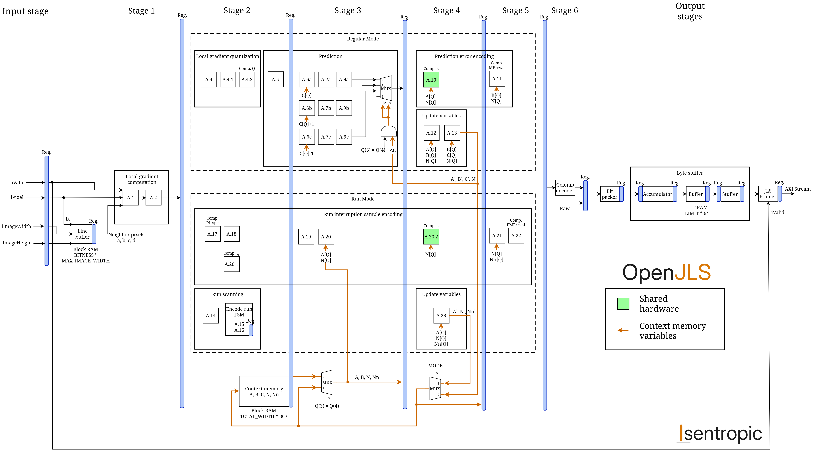
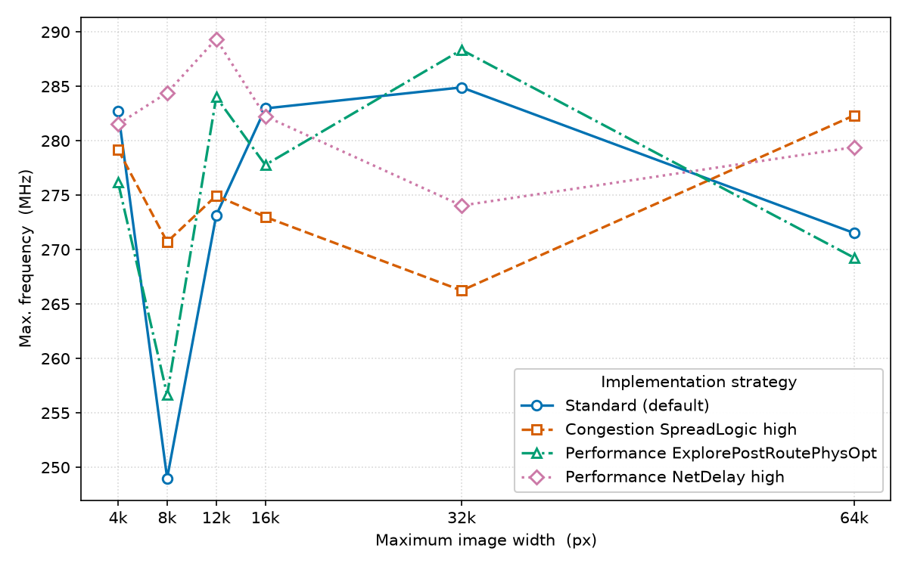
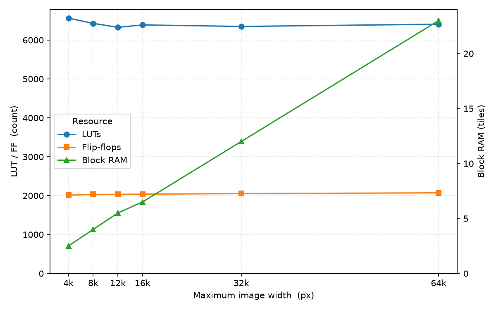
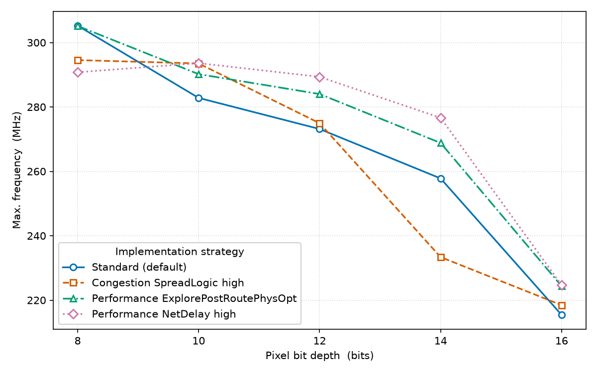
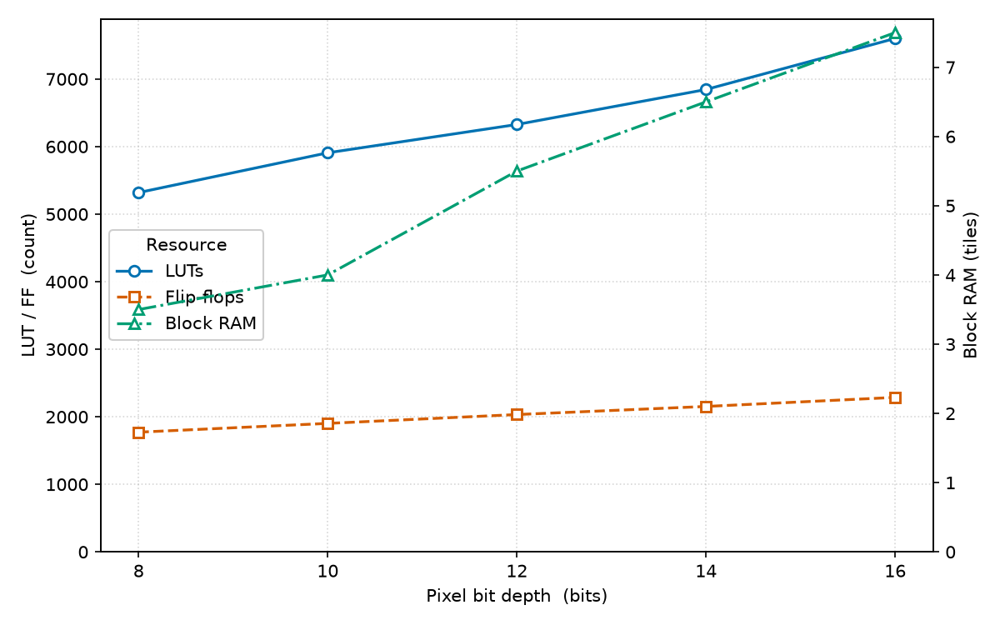

<picture>
  <source media="(prefers-color-scheme: dark)" srcset="Docs/Images/openjls-wordmark-dark.svg">
  
</picture>

OpenJLS is an open, verification-signed JPEG-LS encoder IP core for FPGAs - the open alternative to closed, commercial JPEG-LS cores, for teams who want to audit the RTL and evaluate before they buy.

It implements the JPEG-LS standard (ISO/IEC 14495-1 / ITU-T T.87), a low-complexity lossless image codec with compression ratios comparable to JPEG 2000 lossless at a fraction of the computational cost. Every release is checked byte-exact against an independent reference encoder across 287 images at RTL and on silicon, plus a post-synthesis subset (see [Verification report](https://isentropic-fpga.github.io/OpenJLS/)).

OpenJLS reaches ~280 MHz with 12-bit pixels on a Xilinx UltraScale+ ZU7EG (the MPSoC family used in onboard processors such as the Xiphos Q8), processing one pixel per clock (~280 Mpixel/s) for ~6.4k LUTs and no external memory; 8-bit reaches ~305 MHz and 16-bit ~225 MHz. It handles single-component (grayscale) data, so a multi-band sensor instantiates one compressor per band - resource usage is low enough that all bands run in parallel cheaply.

The RTL is vendor-neutral by construction (plain VHDL-1993 on open-logic memory primitives, which are VHDL-2008) and builds in any synthesis tool; the figures above were characterized on Xilinx.

---

## Resources

- **[Product page](https://isentropic.com.br/openjls)**
- **[Datasheet (PDF)](Docs/datasheet/openjls_datasheet.pdf)**
- **[Verification report](https://isentropic-fpga.github.io/OpenJLS/)**
- **[Interface & integration](#interface)**
- **[Licensing](#licensing)**
- **[Demos](https://github.com/isentropic-fpga/OpenJLS-Demos)**

---

## Features

| | |
|---|---|
| **Compression** | Lossless JPEG-LS (ISO/IEC 14495-1 / ITU-T T.87) |
| **Pixel depth** | 8–16 bits, single component (grayscale) |
| **Image size** | 4 × 1 up to 65535 × 65535 px, set at run time |
| **Throughput** | 1 pixel/clock, ~280 MHz at 12-bit on UltraScale+ |
| **Memory** | On-chip line buffer, one image row; no external memory |
| **Interface** | Ready/valid streaming (AXI4-Stream / Avalon-ST compatible) |
| **Conformance** | Byte-exact vs the ISO reference vectors and [CharLS](https://github.com/team-charls/charls) |
| **Portability** | Vendor-agnostic VHDL on [open-logic](https://github.com/open-logic/open-logic) primitives |

---

## Verification

OpenJLS is verified in [NVC](https://www.nickg.me.uk/nvc/) at RTL and gate level, and on hardware. Results are published in the **[verification report](https://isentropic-fpga.github.io/OpenJLS/)**.

| Suite | Status | Test/Cov | Summary |
|---|---|---|---|
| NVC code coverage | info | 99.8% | Per-DUT-file statement breakdown |
| OSVVM suite | PASS | 100% | 60 tests, 2,877,433 affirmations (module + top + AXI wrappers) |
| Golden model | PASS | 100% | 287/287 images byte-exact vs CharLS |
| Post-synth OSVVM | PASS | 100% | Control-plane stress on the gate-level netlist |
| Post-synth golden model | PASS | 100% | 156/156 images byte-exact vs CharLS |
| Hardware-in-the-loop | PASS | 100% | 287/287 images byte-exact vs CharLS on PYNQ-Z2 silicon |

- **OSVVM** — 29 module testbenches against independent T.87 reference models, a top-level control-plane stress test, and AXI wrapper tests, all with requirements tracking.
- **Coverage** — OSVVM functional coverage plus NVC statement coverage.
- **Golden model** — byte-exact against [CharLS](https://github.com/team-charls/charls) and the official ISO/IEC 14495-1 reference vectors.
- **Design contracts** — PSL assertions on the handshakes, checked every run.
- **Post-synthesis** — stress test and a golden subset re-run on the gate-level netlist.
- **Hardware-in-the-loop** — full corpus encoded on a PYNQ-Z2 at depths 8–16, zero mismatches; reproducible via the [EncodeOverEthernet demo](https://github.com/isentropic-fpga/OpenJLS-Demos).

**Golden-model dataset** — 287 images, from 256×256 up to 39 MP:

| Source | Set | Images |
|---|---|--:|
| [USC-SIPI](https://sipi.usc.edu/database/) | Aerials, textures, miscellaneous, sequences | 210 |
| [imagecompression.info](http://imagecompression.info/test_images/) | 8-bit and 16-bit natural photographs | 30 |
| Generated stress probes | Boundary, predictor-adversarial, high-entropy and fuzz patterns | 47 |

The generated probes ([`gen_stress.py`](Verification/Golden%20model/imageprep/gen_stress.py), seeded and reproducible) cover what natural images never reach: bit depths 9–15, boundary geometries (4×1 up to 65535×1), MED-adversarial patterns and a tiny-image fuzz batch.

---

## Architecture

OpenJLS follows the JPEG-LS encoding pipeline:

1. **Gradient computation** — local gradients from causal pixel neighbors (a, b, c, d)
2. **Context modeling** — gradient quantization into 365 contexts with adaptive bias correction
3. **Prediction** — MED (Median Edge Detector) with context-based bias cancellation
4. **Encoding** — adaptive Golomb-Rice coding for regular mode, run-length encoding for uniform regions
5. **Bitstream packing** — ISO/IEC 14495-1 compliant JPEG-LS output stream

The hardware architecture is based on the optimizations in Mert's [*Key Architectural Optimizations for Hardware Efficient JPEG-LS Encoder*](https://www.researchgate.net/publication/331795298_Key_Architectural_Optimizations_for_Hardware_Efficient_JPEG-LS_Encoder), reworked into a vendor-agnostic, fully pipelined VHDL core.

[`Docs/Requirements.md`](Docs/Requirements.md) is the **source of truth** for the RTL. Every source file under [`Sources/`](Sources/) implements exactly one topic from it — a code segment or written requirement — and is named after that topic. Each and every one of those topics was taken **verbatim from ISO/IEC 14495-1 (ITU-T T.87)**.

---

## Interface

The core is a single entity, `openjls_top`, configured by generics and driven through a pixel-in / bitstream-out streaming interface.

### Generics

| Generic | Range | Description |
|---|:--:|---|
| `BITNESS` | 8–16 | Pixel bit depth. |
| `MAX_IMAGE_WIDTH` | 4–65535 | Largest image width supported; sets the on-chip line-buffer depth. |
| `MAX_IMAGE_HEIGHT` | 1–65535 | Largest image height supported. |
| `OUT_WIDTH` | 48–1024 | Output data-bus width in bits (multiple of 8). |

### Ports

The streaming ports use a plain **ready/valid handshake**; the *AXIS* column gives the 1:1 AXI4-Stream signal mapping for that ecosystem (Avalon-ST maps the same way at `readyLatency = 0`).

| Port | Dir | Width | AXIS | Role |
|---|:--:|---|:--:|---|
| `iClk` | in | 1 | — | Clock; whole core is synchronous to its rising edge. |
| `iRst` | in | 1 | — | Synchronous reset, active high. Also latches the image dimensions (see below). |
| `iImageWidth` | in | 16 | — | Image width in pixels (configuration). |
| `iImageHeight` | in | 16 | — | Image height in pixels (configuration). |
| `iValid` | in | 1 | `TVALID` | Input pixel valid. |
| `iPixel` | in | `BITNESS` | `TDATA` | Input pixel. |
| `oReady` | out | 1 | `TREADY` | Input ready. |
| `oData` | out | `OUT_WIDTH` | `TDATA` | Output bitstream beat. |
| `oValid` | out | 1 | `TVALID` | Output valid. |
| `oKeep` | out | `OUT_WIDTH/8` | `TKEEP` | Valid-byte mask on the final beat. |
| `oLast` | out | 1 | `TLAST` | End of image. |
| `iReady` | in | 1 | `TREADY` | Output ready / downstream backpressure. |

### Integration notes

- **Pixel stream** — unsigned pixels in raster scan order, one per `iValid and oReady`; `oReady` drops only under output backpressure.
- **Dimensions** — `MAX_IMAGE_*` generics size the hardware; `iImageWidth`/`iImageHeight` pick each image's size at run time and latch only while `iRst` is high. Reset on a size change; same-size images run back-to-back. `0` or out-of-range selects the maximum.
- **No input end-of-frame** — end-of-image comes from the dimensions; the output marks it with `oLast` and `oKeep`.

Timing, reset sequencing, latency and an instantiation example are in the [datasheet](Docs/datasheet/openjls_datasheet.pdf).

### Xilinx IP cores

For the Vivado flow the core ships the following pre-packaged IPs:

| IP Catalog name | Interfaces |
|---|---|
| OpenJLS Encoder (Native) | Plain Ready/Valid |
| OpenJLS Encoder (AXI4-Stream) | AXI-Stream for the data, native pins for control |
| OpenJLS Encoder (AXI4-Stream + AXI4-Lite) | AXI-Stream for the data, AXI-Lite for control |

To use, simply add [`Sources/Xilinx/ip_repo/`](Sources/Xilinx/ip_repo/) to the project's IP repositories and the three cores appear in the IP Catalog, ready to drop onto a block design.

#### AXI4-Lite register map

The AXI4-Lite variant replaces the native control pins with a register bank (32-bit registers, word-aligned offsets):

| Offset | Name | Access | Contents |
|---|---|---|---|
| `0x00` | ID | RO | ASCII `"OJLS"` (`0x4F4A4C53`) |
| `0x04` | VERSION | RO | `0x00MMmmpp` (major/minor/patch) |
| `0x08` | CAPS | RO | `[7:0]` `BITNESS`, `[15:8]` output bytes per beat (`OUT_WIDTH`/8) |
| `0x0C` | MAXDIM | RO | `[15:0]` `MAX_IMAGE_WIDTH`, `[31:16]` `MAX_IMAGE_HEIGHT` |
| `0x10` | WIDTH | RW | `[15:0]` image width (clamped on write) |
| `0x14` | HEIGHT | RW | `[15:0]` image height (clamped on write) |
| `0x18` | CTRL | WO | `[0]` APPLY — self-clearing, pulses the core reset |
| `0x1C` | STATUS | RO | `[0]` BUSY (reset pulse active), `[1]` pixel-stream `TREADY` mirror |

Reconfigure by writing WIDTH/HEIGHT and setting CTRL.APPLY: the wrapper resets the core itself and latches the new dimensions, so no separate reset is needed. **APPLY aborts any image in flight — only apply between images**, not during an acquisition. Same-size images need no APPLY. The map ships as a C header, [`Sources/Xilinx/ojls_regs.h`](Sources/Xilinx/ojls_regs.h).

---

## Performance & Resources

Xilinx Zynq UltraScale+ `xczu7eg-fbvb900-1-e` (speed grade −1), Vivado 2025.2, 12-bit unless stated. True fmax (over-constrained until timing fails), RTL-only — no floorplanning or vendor primitives. Representative, not guaranteed.

### Maximum frequency vs `MAX_IMAGE_WIDTH`

Best-of fmax holds **~282–289 MHz** across all sizes; the Default strategy alone gives ~249–285 MHz.

| `MAX_IMAGE_WIDTH` | Default | ExplorePostRoutePhysOpt | NetDelay_high | Congestion_SpreadLogic_high |
|------------------:|--------:|------------------------:|--------------:|----------------------------:|
| 4096 | **282.7** | 276.2 | 281.5 | 279.2 |
| 8192 | 249.0 | 256.7 | **284.4** | 270.7 |
| 12288 | 273.1 | 284.0 | **289.4** | 274.9 |
| 16384 | **283.0** | 277.8 | 282.2 | 273.0 |
| 32768 | 284.9 | **288.4** | 274.1 | 266.2 |
| 65535 | 271.5 | 269.2 | 279.4 | **282.3** |

### Resource usage vs `MAX_IMAGE_WIDTH`

Logic is constant (~6.4k LUTs, ~2.0k FFs); only Block RAM scales, with the line buffer.

| `MAX_IMAGE_WIDTH` | LUTs | FFs | BRAM tiles |
|------------------:|-----:|----:|-----------:|
| 4096 | 6563 | 2013 | 2.5 |
| 8192 | 6429 | 2032 | 4.0 |
| 12288 | 6327 | 2033 | 5.5 |
| 16384 | 6389 | 2039 | 6.5 |
| 32768 | 6350 | 2053 | 12.0 |
| 65535 | 6407 | 2072 | 23.0 |

### Maximum frequency vs `BITNESS`

At `MAX_IMAGE_WIDTH` = 12288: ~305 MHz at 8 bits, ~277 MHz at 14 bits, ~225 MHz at 16 bits.

| `BITNESS` | Default | ExplorePostRoutePhysOpt | NetDelay_high | Congestion_SpreadLogic_high |
|----------:|--------:|------------------------:|--------------:|----------------------------:|
| 8 | **305.3** | 305.2 | 290.8 | 294.6 |
| 10 | 282.8 | 290.2 | **293.6** | 293.5 |
| 12 | 273.1 | 284.0 | **289.4** | 274.9 |
| 14 | 257.8 | 268.8 | **276.6** | 233.4 |
| 16 | 215.4 | 224.4 | **224.7** | 218.4 |

### Resource usage vs `BITNESS`

Pixel depth widens the datapath: ~43% more LUTs from 8 to 16 bits.

| `BITNESS` | LUTs | FFs | BRAM tiles |
|----------:|-----:|----:|-----------:|
| 8 | 5319 | 1772 | 3.5 |
| 10 | 5908 | 1902 | 4.0 |
| 12 | 6327 | 2033 | 5.5 |
| 14 | 6845 | 2153 | 6.5 |
| 16 | 7601 | 2287 | 7.5 |

fmax tables in MHz, best per row in bold; resources from the Default strategy. Reproduce with [`Scripts/run_fmax_sweep.sh`](Scripts/run_fmax_sweep.sh).

---

## Demos

End-to-end example projects live in a companion repository,
[**OpenJLS-Demos**](https://github.com/isentropic-fpga/OpenJLS-Demos), each pinning
the core as a submodule at its verified commit.

- **[EncodeOverEthernet](https://github.com/isentropic-fpga/OpenJLS-Demos/tree/main/EncodeOverEthernet)** — streams raw images to a PYNQ-Z2 over Ethernet, encodes them 100% in the FPGA, and streams the `.jls` files back. Its hardware-in-the-loop sweep is what produces the [HIL verification result](#verification) above.

More demos (additional boards and integrations) are planned.

---

---

## Licensing

OpenJLS is dual-licensed:

- **[GPL v3](LICENSE.md)** — free for any use that complies with GPL v3 terms. This means if you distribute a product containing OpenJLS, your design must also be released under GPL v3.
- **Commercial License** — for use in proprietary/closed-source products without GPL obligations. Contact [Isentropic](https://isentropic.com.br/contact) at contact@isentropic.com.br for pricing and terms.

**Evaluation is unrestricted.** You can clone, simulate, synthesize, and test OpenJLS freely under the GPL. A commercial license is only required when shipping a product.

**Names and logos are not covered by the GPL.** The OpenJLS and Isentropic wordmarks and logos in `Docs/Images/` may be redistributed as part of an unmodified OpenJLS, but the license grant on the code does not extend to them. Forks and derivative works should carry their own name and marks.

---

## Dependencies

Dependencies fall into two independent sets. **Using the IP** needs only the base set below — the core sources are plain VHDL-1993 and synthesize in any EDA tool on any OS; the vendored open-logic files are VHDL-2008, so the toolchain must accept 2008 for those files (any current one does). **Running the verification suite** needs the Linux toolchain in the second table; none of it is part of, or distributed with, the IP.

### Base IP

| Component | License | Notes |
|---|---|---|
| [open-logic](https://github.com/open-logic/open-logic) | LGPL-2.1+ with PSI HDL exception | Vendor-agnostic memory and FIFO primitives, written in VHDL-2008. Weak copyleft confined to its own files; the exception explicitly permits distributing FPGA bitstreams under your own terms. |

The IP carries no OS or vendor lock-in — it builds with Vivado, Quartus, Libero, Lattice, or open-source tools. (The performance figures above were characterized with AMD Vivado, but any synthesis tool works.)

### Verification

The verification flows are bash-driven and built around the NVC simulator; they run on Linux and are not supported on Windows.
None of the components below are committed to the repository — running [`ThirdParty/fetch_third_party.sh`](ThirdParty/fetch_third_party.sh) materializes them all: vendoring the HDL with its license texts, building CharLS from source, and installing NVC.

| Component | License | Notes |
|---|---|---|
| [NVC](https://www.nickg.me.uk/nvc/) | GPL-3.0 | VHDL simulator for all simulation, coverage, and post-synthesis flows; developed and tested with NVC 1.21. Not vendored — its GPL covers the simulator, not the IP it runs. |
| [CharLS](https://github.com/team-charls/charls) | BSD-3-Clause | JPEG-LS reference encoder for the golden-model cross-check; built from source at a pinned commit by `ThirdParty/fetch_third_party.sh`. |
| [OSVVM](https://github.com/OSVVM/OSVVM) | Apache-2.0 | VHDL verification library used by the testbench suite. |
| [OSVVM-Scripts](https://github.com/OSVVM/OSVVM-Scripts) | Apache-2.0 | Regression and report-generation script flow. |
| [tcllib](https://github.com/tcltk/tcllib) | Tcl/BSD-style | `fileutil` and `yaml` modules required by the report scripts. |

open-logic is committed in-tree, so the IP builds without the fetch step. NVC installs through your OS package manager — the script handles Ubuntu and Arch automatically; elsewhere install it manually from the [NVC docs](https://www.nickg.me.uk/nvc/). No dependency imposes copyleft on the OpenJLS sources, so the dual-licensing model above is unaffected. Redistribution must retain the third-party notices and license texts in `ThirdParty/`.

---

## References

- [Key Architectural Optimizations for Hardware Efficient JPEG-LS Encoder](https://www.researchgate.net/publication/331795298_Key_Architectural_Optimizations_for_Hardware_Efficient_JPEG-LS_Encoder) — Y. M. Mert, IEEE (2018). The hardware architecture OpenJLS is based on.
- [ISO/IEC 14495-1](https://www.itu.int/rec/T-REC-T.87) — JPEG-LS standard specification (ITU-T T.87)
- [open-logic](https://github.com/open-logic/open-logic) — Vendor-agnostic VHDL building blocks used in this project
- [OSVVM](https://osvvm.org/) — VHDL verification methodology (constrained-random + functional coverage) used by the testbench suite
- [NVC](https://www.nickg.me.uk/nvc/) — VHDL simulator used for all simulation, coverage, and post-synthesis flows
- [CharLS](https://github.com/team-charls/charls) — JPEG-LS reference codec used as the golden model for conformance

---

## Contact

OpenJLS is developed and maintained by

<a href="https://isentropic.com.br">
  <picture>
    <source media="(prefers-color-scheme: dark)" srcset="Docs/Images/isentropic-wordmark-dark.svg">
    
  </picture>
</a>

For commercial licensing, technical questions, or collaboration inquiries: [isentropic.com.br](https://isentropic.com.br/contact) or contact@isentropic.com.br
